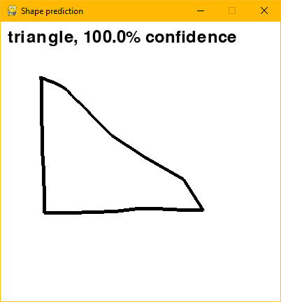
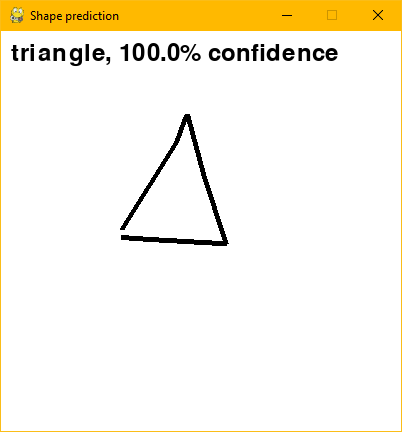
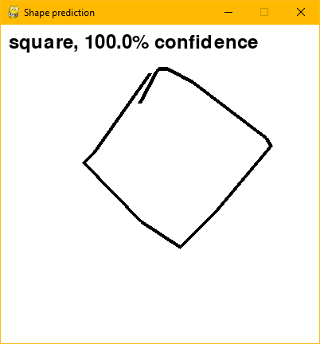
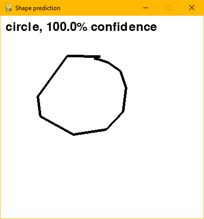

# ShapeCNN

Simple project to solve classification problem recognizing between circle, square and triangle.

## Libraries

Project requires following libraries: `torch torchvision tqdm pillow numpy pygame`

### Dataset Generator

`dataset_generator.py` allows to generate _n_ images containing shapes: **circles**, **squares** and **triangles**. All parameters are available with `dataset_generator.py --help`

Example usage:
`python dataset_generator.py --count 1000 --type circle --width 100 --height 100 --directory 'dataset/circles'`
c

### Training model

To run training model, use `python cnn.py`. Script will read CNN architecture from `shapecnn.py` file and will apply transforms defined in `util.py` called `transform_training`.

```
Epoch 98/100, Loss: 0.5861298441886902
100%|████████████████████████████████████████████████████████████████████████████████████████| 75/75 [00:06<00:00, 12.27it/s]
Epoch 99/100, Loss: 0.5554232597351074
100%|████████████████████████████████████████████████████████████████████████████████████████| 75/75 [00:06<00:00, 12.37it/s]
Epoch 100/100, Loss: 0.5829394459724426
Accuracy on the test set: 96.33333333333333
```

### Drawing

To run canvas to draw on, use `python drawer.py`. This will open a window that can be drawn on. Classifier will be automatically called to recognize shape.

| Right triange                     | Triangle                          | Skewed square                     | Circle                            |
| --------------------------------- | --------------------------------- | --------------------------------- | --------------------------------- |
|  |  |  |  |
